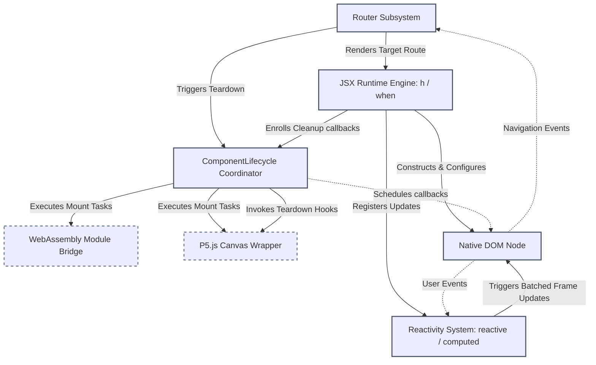

# Propa Framework


Propa is a lightweight, dependency-free framework designed to build reactive web applications using TypeScript and Vite. By transforming JSX directly into native Document Object Model (DOM) operations rather than relying on a Virtual DOM, the library reduces runtime abstractions. It includes unified state reactivity, hash-based and path-based routing, component lifecycle coordination, and dedicated helpers for WebAssembly (WASM) and P5.js.

---

## Technical Architecture

The following diagram illustrates how the core subsystems of the Propa runtime interact during an application's execution cycle. It depicts how routing updates or user interactions propagate through the lifecycle coordinator and the reactivity system to update native DOM nodes.



---

## Core Subsystems

### 1. Smart Reactivity and Dependency Tracking
State in Propa is driven by the `reactive` wrapper, which utilizes JavaScript Proxies to observe mutations on primitives, arrays, object structures, and built-in types such as Dates, Maps, and Sets. Deriving secondary state is accomplished through `computed` values. When a computed property runs its calculation function, it registers itself on an execution stack. This allows any reactive value read during the calculation to be automatically tracked as a dependency.

To prevent excessive layout recalculations in the browser, mutations are not immediately applied to the DOM. Instead, updates are cached and scheduled to run in a single batch on the next browser animation frame using `requestAnimationFrame`, falling back to a microtask queue in environments where `requestAnimationFrame` is unavailable, such as during server-side rendering.

### 2. Direct-to-DOM JSX Transformation
Rather than introducing the complexity and memory overhead of a Virtual DOM reconciliation pass, Propa compiles JSX templates directly into native browser elements. The JSX factory function `h` receives the element tag, configuration properties, and child nodes. If the tag is a functional component, it is executed immediately as a plain function. Otherwise, the runtime invokes `document.createElement`.

When a reactive primitive is passed as a child node in a JSX template, Propa automatically instantiates a text node and subscribes to state modifications. Whenever the reactive value changes, the text node updates its content directly. 

Conditional rendering is handled via the `when` utility. Rather than fully re-rendering the surrounding container, `when` inserts a comment node placeholder. It then binds a subscriber to the conditional state to append or remove the target element dynamically relative to the placeholder.

### 3. Component Lifecycle and Routing
Single Page Applications built with Propa rely on the `Router` class to manage transitions between views. The router supports both hash-based routing and history-based path routing. During a transition, the router coordinates with the `ComponentLifecycle` manager to perform two primary phases:

1. **The Unmount Phase**: Before updating the container, the lifecycle coordinator executes all cleanup routines registered by the outgoing component tree. This phase unsubscribes observers, clears active timers, and destroys third-party library instances to prevent memory leaks.
2. **The Mount Phase**: Once the new route's element tree is appended to the DOM, the router schedules the execution of the new component's mount callbacks inside a coordinated frame.

Functional components can declare lifecycle-bound logic using `ComponentLifecycle.onMount` and `ComponentLifecycle.onUnmount`. Returning a function from `onMount` acts as an automatic cleanup registration.

### 4. Hardware and Canvas Integrations
The framework features direct interfaces for low-level performance-critical modules:

* **P5.js Integration**: The `createP5Sketch` utility bridges canvas sketch lifecycles with the component runtime. It provisions an automated division of responsibilities; when the parent component mounts, the library instantiates the P5 runtime inside the designated host container. When unmounted, it executes P5 teardown steps to free up graphic memory.
* **WebAssembly Integration**: The `WasmModule` and `TypedWasmModule` classes, paired with loading helpers, simplify loading and interacting with compiled WebAssembly binaries. It provides safe wrappers to handle browser-side memory allocations and deallocations when exchanging typed arrays with compiled WASM buffers.

---

## Getting Started

To utilize Propa inside a Vite and TypeScript environment, configure the compiler and bundler to use the custom JSX factory.

### Bundler Configuration
Configure your `vite.config.ts` to transform JSX using Propa's custom hyperscript factory:

```typescript
import { defineConfig } from 'vite';

export default defineConfig({
  esbuild: {
    jsx: 'transform',
    jsxFactory: 'h',
    jsxFragment: 'Fragment'
  }
});
```

### TypeScript Configuration
Update your `tsconfig.json` to instruct the compiler on resolving JSX syntax:

```json
{
  "compilerOptions": {
    "target": "ES2020",
    "module": "ESNext",
    "lib": ["DOM", "ES2020"],
    "jsx": "react",
    "jsxFactory": "h",
    "jsxFragmentFactory": "Fragment",
    "strict": true
  }
}
```

### Application Entrypoint
To render your application, initialize the router and declare your registered routes:

```tsx
import { h, Router, reactive, ComponentLifecycle } from '@salernoelia/propa';

function CounterApp() {
  const count = reactive(0);

  ComponentLifecycle.onMount(() => {
    console.log('App has mounted successfully');
    return () => console.log('Cleaning up app state');
  });

  return (
    <div className="container">
      <h1>Propa Application</h1>
      <p>Current Count: {count}</p>
      <button onClick={() => count.value++}>Increment</button>
    </div>
  );
}

const router = new Router(false, true);
router.addRoute('/', () => <CounterApp />);
```
